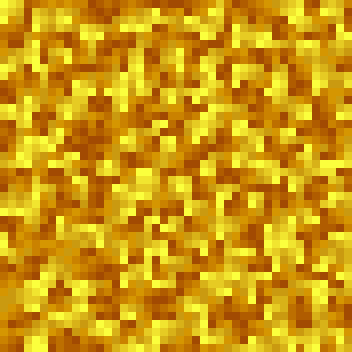

# 🎄 Advent of Code 2024

Solutions for [Advent of Code](https://adventofcode.com/) in [Rust](https://www.rust-lang.org/).

> **Note**
> Puzzle inputs are not checked into
> git. [Reasoning](https://old.reddit.com/r/adventofcode/comments/k99rod/sharing_input_data_were_we_requested_not_to/gf2ukkf/?context=3)
> .

## 2024 Results

I had a secondary goal of clearing all puzzles in under 1 second. The profile doesn't include loading the file from 
storage but does include parsing for fairness.

**Total Runtime: 603.2568ms**
```
🎄Day 1 (113.7µs) 🎄
~~~~~~~~~~~~~~~~~~~~~
Parse : (29µs)
Part 1: 1151792 (55.8µs)
Part 2: 21790168 (28.9µs)

🎄Day 2 (403.1µs) 🎄
~~~~~~~~~~~~~~~~~~~~~
Parse : (70.6µs)
Part 1: 631 (55.2µs)
Part 2: 665 (277.3µs)

🎄Day 3 (318.9µs) 🎄
~~~~~~~~~~~~~~~~~~~~~
Parse : (316.6µs)
Part 1: 188192787 (1.1µs)
Part 2: 113965544 (1.2µs)

🎄Day 4 (377.5µs) 🎄
~~~~~~~~~~~~~~~~~~~~~
Parse : (117µs)
Part 1: 2662 (185.6µs)
Part 2: 2034 (74.9µs)

🎄Day 5 (538.2µs) 🎄
~~~~~~~~~~~~~~~~~~~~~
Parse : (227.8µs)
Part 1: 4609 (303.6µs)
Part 2: 0 (6.8µs)

🎄Day 6 (591.8072ms) 🎄
~~~~~~~~~~~~~~~~~~~~~
Parse : (865.3µs)
Part 1: 5199 (528.2µs)
Part 2: 1915 (590.4137ms)

🎄Day 7 (8.8938ms) 🎄
~~~~~~~~~~~~~~~~~~~~~
Parse : (411.5µs)
Part 1: 975671981569 (877.7µs)
Part 2: 223472064194845 (7.6046ms)

🎄Day 8 (584.9µs) 🎄
~~~~~~~~~~~~~~~~~~~~~
Parse : (167.1µs)
Part 1: 254 (178.3µs)
Part 2: 951 (239.5µs)

🎄Day 10 (219.5µs) 🎄
~~~~~~~~~~~~~~~~~~~~~
Parse : (37.9µs)
Part 1: 566 (106.3µs)
Part 2: 1324 (75.3µs)
```

# Visualizations
For fun!
## Day 10

